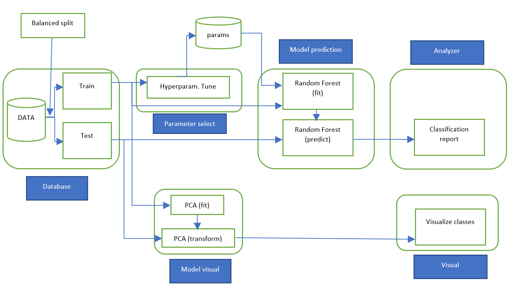

# M05_MiniProject

## Table of contents
* [General Information and Purpose](#general-information-and-purpose)
* [Introduction of the Topic](#introduction-of-the-topic)
* [Overview Repository](#overview-repository)
* [Data](data)
* [Workflow and Model Overview](#workflow-and-model-overview)
* [Tests](#tests)
* [Installation & Configuration](#installation--configuration)
* [Tools & Technologies](#tools--technologies)
* [Authors](#authors)

## General Information and Purpose

Describe the main purpuse of the miniproject.

## Introduction of the Topic

Description of the project topic.

## Overview Repository

    .
    ├── ...
    ├── notebooks                       # Contains all jupyter notebook files
    │   ├── DataVisualisation.ipynb     # Visualisation of Data
    │   ├── ModelDevelopment            # Construciton of the main modell with partial steps
    │   └── ...                         # ....
    │
    ├── pyfiles
    │   ├── main.py
    │   ├── preprocessor.py
    │   ├── algorithm.py
    │   ├── analysis.py
    │   └── unit_test.py
    └── ...

  
## Data

Description of the data and the source.

[Source of the data](https://archive.ics.uci.edu/ml/datasets/One-hundred+plant+species+leaves+data+set "Link to data")

## Workflow and Model Overview

## Tests

Describe the used unit test and the expected results.

## Installation & Configuration

Description of how to execute and run the model. 

## Tools & Technologies

Listing of Software and other tools

Project is created with:
* Lorem version: 12.3
* ...

## Authors

[Fabio Mensi](https://github.com/mensif)  
[Adi Niederberger](https://github.com/niedeado)   

  
[(Back to top)](#table-of-contents)

